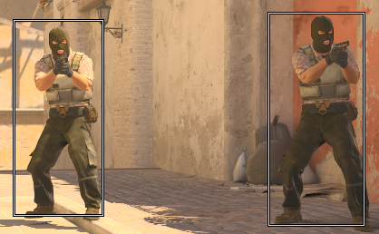

# Lightweight CS2 Cheat

Simple box ESP for Counter-Strike 2, with automatically updating offsets. 

Uses ~0% CPU, ~0.5% GPU and ~10Mb of RAM.

## Usage

1. Link statically against `curl`, `nlohmann/json` and the provided `cs2_dumper.lib` & compile

2. Load Counter-Strike 2 into the main menu & run the program

Press `pause / break` key to exit.

A beep noise will go off upon startup and on exit.

## Showcase

## License

Licensed under the MIT license ([LICENSE](./LICENSE)).